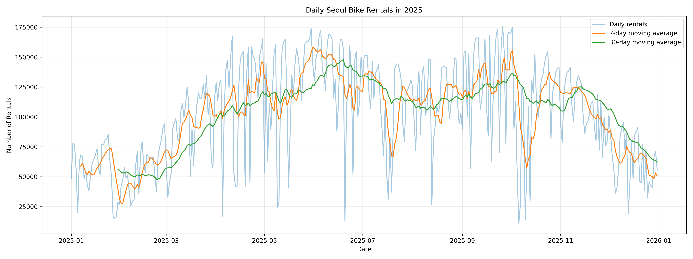
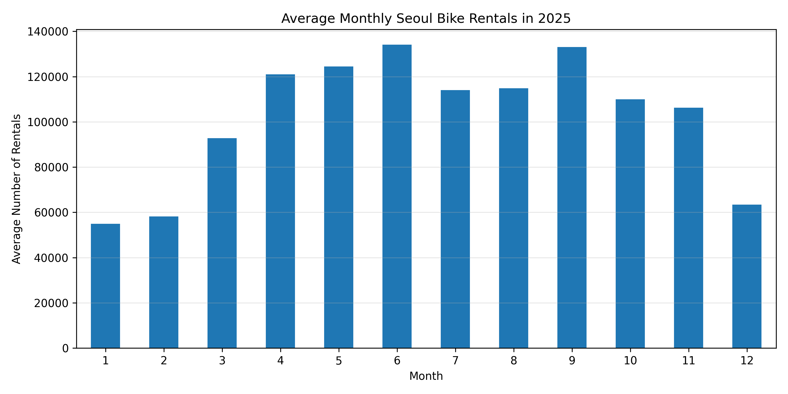
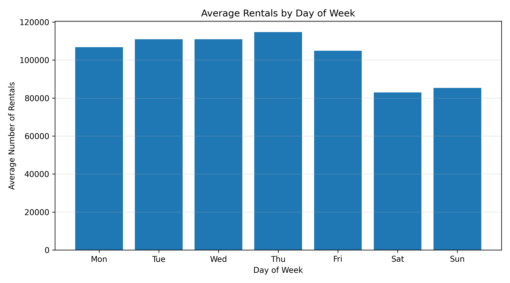
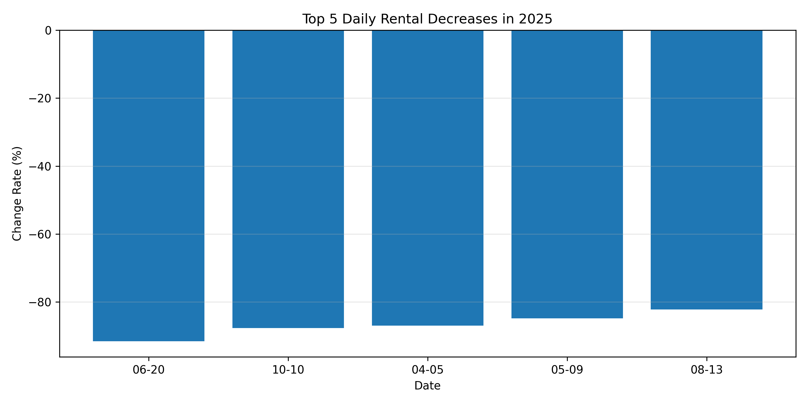

# 🚲 서울 공공자전거 따릉이 이용량 시계열 분석

2025년 서울 공공자전거 따릉이의 일별 대여건수를 활용하여  
시간에 따른 이용량 추세, 월별·요일별 패턴, 급격한 이용량 변화 구간을 분석한 프로젝트입니다.

이동평균, 기간별 집계, 전일 대비 변화율 등의 기본 시계열 분석 기법을 적용하고,
시각화를 통해 데이터에서 확인되는 패턴과 가능한 해석을 구분하여 정리했습니다.

---

## 📌 분석 질문

1. 2025년 따릉이 이용량은 시간에 따라 어떤 추세를 보였는가?
2. 따릉이 이용량은 월별로 어떤 차이를 보이는가?
3. 따릉이 이용량은 요일에 따라 어떤 차이를 보이는가?
4. 이용량이 급격하게 증가하거나 감소한 시점은 언제인가?

---

## 📊 데이터

- 데이터명: 서울특별시 공공자전거 일별 대여건수
- 출처: 서울 열린데이터광장
- 분석 기간: 2025-01-01 ~ 2025-12-31
- 데이터 수: 365개
- 데이터 단위: 일(day)

### 사용 데이터

- 2025년 1~6월 일별 대여건수
- 2025년 7~12월 일별 대여건수

데이터 출처:  
https://data.seoul.go.kr/dataList/OA-14994/A/1/datasetView.do

데이터 이용 시 서울 열린데이터광장의 해당 데이터셋 이용조건을 확인해야 합니다.

---

## 🔍 분석 방법

다음 시계열 분석 기법을 사용했습니다.

### 1. 7일 이동평균
일별 변동을 완화하여 단기적인 이용량 추세를 확인했습니다.

### 2. 30일 이동평균
보다 장기적인 이용량 변화 흐름을 확인했습니다.

### 3. 월별·요일별 집계
월과 요일에 따른 반복적인 이용 패턴을 비교했습니다.

### 4. 전일 대비 변화율
전날과 비교하여 이용량이 급격하게 증가하거나 감소한 날짜를 탐색했습니다.

---

## 📈 주요 분석 결과

### 1. 일별 대여건수 및 이동평균



겨울철에는 대여량이 낮고 봄부터 증가하는 흐름을 보였습니다.  
6월까지 증가한 후 7~8월에는 다소 감소하고,
9월에 다시 증가한 뒤 연말로 갈수록 감소하는 패턴이 나타났습니다.

---

### 2. 월별 평균 대여건수



- 1월 평균: 약 54,979건
- 6월 평균: 약 134,144건
- 9월 평균: 약 133,078건
- 12월 평균: 약 63,393건

겨울보다 봄, 초여름, 초가을의 이용량이 상대적으로 높게 나타났습니다.

---

### 3. 요일별 평균 대여건수



목요일의 평균 대여건수가 가장 높았고 토요일이 가장 낮았습니다.

평일 평균은 약 109,663건, 주말 평균은 약 84,131건으로
주말 이용량이 평일보다 약 23% 낮게 나타났습니다.

---

### 4. 급격한 이용량 감소



전일 대비 변화율을 분석한 결과 특정 날짜에
80~90% 이상의 일시적인 이용량 감소가 발생했습니다.

대표적으로 2025년 6월 20일에는
전일 대비 약 91.6%의 감소가 나타났습니다.

---

## 💡 주요 인사이트

1. **계절에 따른 이용량 차이가 나타났다.**
   - 겨울에는 이용량이 낮고 봄부터 증가하는 패턴을 확인했습니다.
   - 기상 조건이 영향을 미쳤을 가능성이 있지만 현재 데이터만으로 직접적인 원인을 단정할 수는 없습니다.

2. **주말보다 평일 이용량이 높았다.**
   - 평일의 평균 이용량이 주말보다 약 23% 높게 나타났습니다.
   - 출퇴근 및 통학 등 일상적인 이동 수요가 영향을 주었을 가능성이 있습니다.

3. **특정 날짜에 일시적인 급감 현상이 존재했다.**
   - 일부 날짜에서 전일 대비 80~90% 이상의 급격한 감소가 나타났습니다.
   - 향후 강수량, 기온, 공휴일 데이터 등을 결합하면 원인을 추가로 분석할 수 있습니다.

자세한 분석 내용은 [`REPORT.md`](REPORT.md)에서 확인할 수 있습니다.

---

## 🗂 프로젝트 구조

```text
seoul-bike-analysis/
│
├── data/
│   ├── 서울특별시 공공자전거 일별 대여건수_25.1-6.csv
│   └── 서울특별시 공공자전거 일별 대여건수_25.7-12.csv
│
├── images/
│   ├── 01_daily_trend.png
│   ├── 02_monthly_average.png
│   ├── 03_weekday_average.png
│   └── 04_largest_decreases.png
│
├── seoul_bike_analysis.ipynb
├── REPORT.md
├── README.md
└── requirements.txt
```
